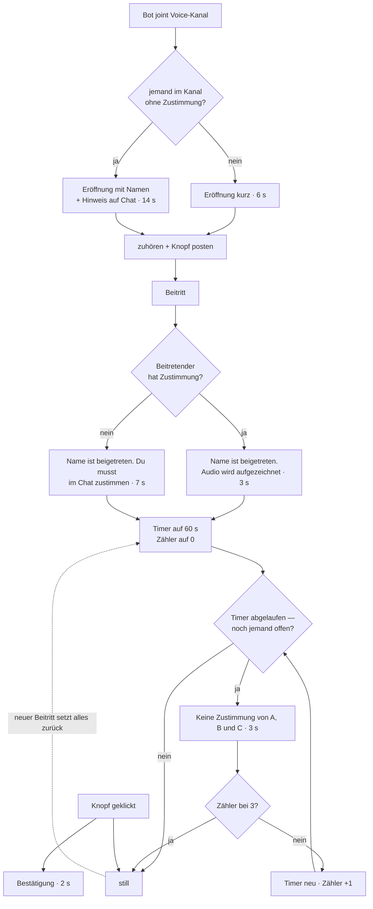

# Discord-Bot: Sprachansagen im Voice-Kanal

**Umgesetzt mit Issue #1032 (2026-08-13).** Dieses Dokument beschreibt den Code.
Der Zustand davor steht im Abschnitt [Vorher/Nachher](#redezeit-vorhernachher).

Leitsatz: **Der Bot spricht nur, wenn es etwas zu klären gibt.** Vorher redete er
auch dann, wenn längst alle zugestimmt hatten, und wiederholte dieselbe
Anleitung dreimal.

## Die vier Cues

Ein Cue ist ein Auslöser. Ob jemand zugestimmt hat, ist eine **Bedingung am
Cue**, kein eigener Cue — deshalb hat „Beitritt" zwei Textvarianten und nicht
zwei Zeilen.

| Cue | Auslöser | Bedingung | Gesprochener Text | Häufigkeit |
|---|---|---|---|---|
| **Eröffnung** | Bot betritt den Kanal | niemand offen | „Der Lorspai hat den Kanal betreten und nimmt die Sitzung für die Kampagne *X* auf." | 1× je Sitzung |
| | | ≥ 1 offen | „… auf. Es fehlt die Zustimmung von *A*, *B* und *C* für die Audioaufnahme. Bitte im Chat der Aufnahme zustimmen." | |
| **Beitritt** | jemand betritt den Kanal | hat zugestimmt | „*Name* ist beigetreten. Audio wird aufgezeichnet." | je Beitritt |
| | | offen | „*Name* ist beigetreten. Du musst der Verarbeitung im Chat zustimmen, um die Audioaufnahme zu starten." | |
| **Erinnerung** | Timer läuft ab | noch jemand offen | „Keine Zustimmung von *A*, *B* und *C*." | max. 3× je Timer-Lauf |
| | | niemand offen | — nichts, Timer stoppt | |
| **Bestätigung** | Knopf geklickt | — | „*Name* hat der Aufnahme zugestimmt." | je Klick |

„Lorspai" ist **kein Tippfehler**, sondern phonetische Schreibweise für die TTS
(Live-Fund #989: „LoreSpy" wird deutsch als „Schpei" gesprochen, weil `sp-` am
Wortanfang zu „schp" wird).

## Der eine Timer

Es gibt **kein zusätzliches Sammelfenster**. Der Erinnerungs-Timer ist die
einzige Uhr, und ein Beitritt ist das Einzige, was ihn anfasst.

| Ereignis | Wirkung auf den Timer | Wirkung auf den Zähler |
|---|---|---|
| Beitritt (egal wer) | startet neu bei 60 s | zurück auf 0 |
| Timer läuft ab, jemand offen | startet neu bei 60 s | +1 — bei 3 still |
| Timer läuft ab, niemand offen | stoppt | — |
| Letzte offene Person klickt | stoppt | — |

Weil der Zähler bei jedem Beitritt zurückgeht, heißt „dann still" **nicht**
„still für den Abend": Kommt später jemand Neues, beginnt die Zählung von vorn.
Anders wäre ein Spätankömmling nie erinnert worden.

## Ablauf

Die Eröffnung liegt bewusst **vor** dem Zuhören: Einwilligung vor Aufzeichnung,
und die eigene Ansage kann so nicht im Mitschnitt landen (#989). Wer beim
Bot-Join schon im Kanal sitzt, gilt als begrüßt und bekommt keine eigene
Beitritts-Ansage — die Eröffnung spricht den ganzen Raum an.

## Redezeit: Vorher/Nachher

Szenario: vier Personen, zwei davon mit gültiger Einwilligung schon im Kanal,
zwei ohne kommen dazu und klicken nach etwa einer halben Minute.

| Cue | Ist | Soll |
|---|---:|---:|
| Eröffnung | 17 s | 6 s |
| Beitritt A | 7 s | 7 s |
| Beitritt B | 7 s | 7 s |
| Erinnerung 1 | 15 s | — |
| Erinnerung 2 | 15 s | — |
| Bestätigung A | 2 s | 2 s |
| Bestätigung B | 2 s | 2 s |
| **Gesamt** | **65 s** | **24 s** |

Die Erinnerung entfällt im Soll vollständig: Sie greift erst 60 s nach dem
letzten Beitritt, und da haben beide längst geklickt. Genau das ist die Wirkung
des späteren Takts — im gut laufenden Fall fällt sie einfach aus.

**Schlechtester Fall** (niemand klickt): Eröffnung 6 s, zwei Beitritte à 7 s,
drei Erinnerungen à 3 s — zusammen **29 s**, verteilt über gut vier Minuten,
danach still. Im Ist wären es an derselben Stelle 61 s. Der Gewinn kommt weniger
aus dem Deckel als daraus, dass die Erinnerung von 15 s auf 3 s schrumpft: Sie
nennt nur noch Namen, weil die Anleitung einmalig woanders steht.

Die Sekundenwerte sind aus der Textlänge geschätzt (rund 14 Zeichen pro Sekunde
deutscher piper-Sprache), **nicht gemessen**. Für den Vergleich reicht das; wer
einen Absolutwert gegen ein Ziel prüfen will, muss messen.

## Was das kostet, und was dagegen hilft

Die Anleitung „wo klicke ich" wird von dreimal auf **einmal** reduziert. Das ist
der bewusst eingegangene Handel — und er wäre gefährlich, wenn die Anleitung nur
in der Eröffnung stünde: Wer später dazukommt, hätte sie nie gehört.

Deshalb steht sie seit dieser Entscheidung in der **Beitritts-Ansage der
betroffenen Person selbst** („Du musst der Verarbeitung im Chat zustimmen").
Jeder Betroffene hört sie damit mindestens einmal, unabhängig davon, wann er
kommt. Der Rest der Runde wird nicht damit behelligt.

Verbleibende Ehrlichkeit: Der Consent-Knopf ist eine **Textnachricht im Kanal**.
Wer Discord im Hintergrund laufen hat und nicht hinsieht, bemerkt ihn nicht. Die
gesprochenen Erinnerungen sind das Einzige, was solche Leute erreicht — deshalb
sind sie gekürzt, aber nicht gestrichen.

## Offene Punkte

Beide folgen daraus, dass die Beitritts-Ansage pro Person läuft (die „Du"-Anrede
funktioniert nur einzeln):

- **Spitzenlast.** Trudeln zu Spielbeginn sechs Leute innerhalb einer Minute
  ein, sind das sechs Einwürfe hintereinander — bei Offenen rund 42 s am Stück.
  Zu entscheiden: so lassen, oder ab einer Schwelle zusammenfassen.
- **Reihenfolge.** Wer zwei Sekunden nach dem Bot hereinkommt, hört seinen Namen
  erst in der Eröffnungs-Fehlliste und direkt danach in der eigenen
  Beitritts-Ansage. Vorschlag: die Beitritts-Ansage überspringen, wenn die
  Person in der Eröffnung schon namentlich genannt wurde.

## Wo das im Code sitzt

| Baustein | Modul |
|---|---|
| Alle Ansage-Texte (pure Funktionen) | `Worker.Discord.Announcement` |
| Wer ist offen? (Namen für die Eröffnung) | `Worker.Discord.Announcer.missing_names/1` |
| Timer + Zähler, Wiederholung | `Worker.Discord.Announcer` (`@pending_delay_ms`, `pending_fire/1`) |
| Deckel + Reset | `Worker.Discord.AnnounceQueue` (`max_pending_reminders/0`, `reset_pending_told/1`) |
| Version des Wortlauts | `Worker.Discord.ConsentGate.version/0` |

Die Consent-**Version** ist mit diesem Umbau von `Worker.Recording.ConsentPhrase`
zum `ConsentGate` gewandert. Sie gehört dorthin, weil das Gate sie durchsetzt:
Eine persistierte Zustimmung gilt nur, wenn ihre Version zur aktuellen passt —
ändert sich der Wortlaut, wird neu gefragt. Das Format `v<n>` ist Pflicht, sonst
liefert `Materializer.version_rank/1` still 0 und die Prüfung wäre lautlos
ausgehebelt.

## Was mit dieser Entscheidung wegfällt

Der seit #1005 stillgelegte **gesprochene Zustimmungs-Pfad**
(`Worker.Recording.ConsentPhrase`) wird entfernt statt weiter mitgeschleppt. Er
war mit #1002 gebaut und mit #1005 ausgesetzt worden, weil Akustik nicht
identitätsgebunden ist (Cross-Talk oder Lautsprecher-Echo könnten einem Dritten
eine Zustimmung unterstellen — der schwerste denkbare Fehler an dieser Stelle).
Der Knopf im Chat bleibt der einzige Weg. Konkret entfernt: die Module
`Worker.Recording.ConsentPhrase` und `Worker.Discord.ConsentCheck` samt Tests,
und die Zeile „oder sage: …" aus der Knopf-Nachricht — sie bot einen Weg an,
der nichts mehr auslöste, und hätte die Spur dessen gekostet, der ihr folgt.
