# Pipeline-Flow: Audio → Chronik/Epos/Resümee

Der reale Weg eines Sitzungsmitschnitts durch Hub und Worker — vom Browser-Audio
bis zu den drei abgeleiteten Artefakten. Belegt gegen den Quellcode (`apps/hub`
+ `apps/worker`); Datei/Zeile sind Orientierung, nicht garantiert stabil.

Ergänzt die dichte Referenz-Prosa in `CLAUDE.md` (Abschnitte „Die Pipeline:
Wahrheitsbild“ und „Stufe 2 ist Jack“) um eine visuelle Flow-Übersicht fürs
Onboarding.

> **Stand J4 (#1207):** Stufe 2 ist Jack, Stufe 3 (Verify) entfällt. Schritte
> 8–14 und die Hinweise unten sind auf diesen Stand nachgezogen; die
> Datei:Zeile-Angaben der Schritte 1–7 stammen vom früheren Stand und sind nicht
> neu geprüft.

> **Interaktive Fassung** (hell/dunkel, farbcodiert): [`docs/pipeline-flow.html`](./pipeline-flow.html)
> — im Browser öffnen (`xdg-open docs/pipeline-flow.html`).

## Überblick

```mermaid
flowchart TD
  subgraph A["Aufnahme · apps/hub"]
    A1["1 · MicCapture-Hook<br/>pushEvent audio_chunk"]
    A2["2 · MicLive → Commands.forward_audio_chunk<br/>Owner-Worker (target_worker_id) bzw. pick_leader"]
    A3["3 · WorkerChannel push(audio_chunk)"]
  end
  subgraph B["Transkription · apps/worker"]
    B4["4 · AudioBuffer.append/4 → .webm on-disk"]
    B5["5 · finalize → SessionEnded → Transcribe.run_mixed<br/>(via GpuQueue.run)"]
    B6["6 · Whisper -ojf → read_segments<br/>+ aggregate_token_confidence"]
    B7["7 · UtteranceAppended (batch)<br/>+ UtterancesTranscribed (genau 1×)"]
  end
  subgraph C["Pipeline · apps/worker · run_wahrheitsbild"]
    C8["8 · Trigger + elected? (Author-Worker)<br/>→ GpuQueue.run(run_stages)"]
    C9["9 · Glättung → TranscriptSmoothed"]
    C10["10 · Gap-Fill SYNCHRON #924<br/>→ LueckenVorschlagGeneriert"]
    C11["11 · Jack (Stufe 2, lokal)<br/>Gedächtnis → Extraktion → Verifikation<br/>→ SessionFactsExtracted + JackStandAbgelegt"]
    C12["12 · Registry: Guise + Bogen<br/>(best-effort, auf Jacks Modell)"]
    C13["13 · Bestand zurücklesen<br/>(keine Stufe, kein zweites Modell)"]
    C13b["13b · Zeit-Jack (#1247)<br/>Gedächtnis → Einsortieren → Prüfen<br/>→ ZeitKettengliedSet je Glied + ZeitAnkerSet"]
  end
  subgraph OUT["Ausgabe · Geschwister aus den geprüften Fakten"]
    O1["Resümee-Jack<br/>Überblick → Schreiben → Durchsicht<br/>SessionSummaryGenerated + JackResuemeeStandAbgelegt"]
    O2["Chronik-Jack<br/>Überblick → Schreiben → Durchsicht<br/>ChronikEntryChanged"]
    O3["Epos-Jack<br/>Überblick → Schreiben → Durchsicht<br/>EposEntryEdited + JackEposStandAbgelegt"]
  end
  A1 --> A2 --> A3 --> B4
  B4 --> B5 --> B6 --> B7 --> C8
  C8 --> C9 --> C10 --> C11 --> C12 --> C13 --> C13b
  C13b --> O1
  O1 --> O2
  O2 --> O3
```

## Schritt für Schritt

| # | Schritt | Datei:Zeile | Event(s) | Settings |
|---|---|---|---|---|
| 1 | Browser-Mikro erfasst Audio (`MicCapture`-Hook, opus/webm 16 kHz) | `apps/hub/assets/js/hooks/record_mic.js` | `audio_chunk` (Channel) | `mic_mode` (per_player/multi) |
| 2 | Hub routet zum Member-Worker | `mic_live.ex:194` → `commands.ex:272`, `pick_leader :286` | — | — |
| 3 | WorkerChannel schiebt den Chunk raus | `worker_channel.ex:249→256` | `push("audio_chunk")` | — |
| 4 | AudioBuffer schreibt on-disk (`IO.binwrite` .webm) | `hub_client/mic.ex:50` → `audio_buffer.ex` | — | `audio_dir` |
| 5 | Stop → `finalize` → Transkription (via `GpuQueue.run`) | `audio_buffer.ex:270`, SessionEnded `:309`, `:625` | `SessionEnded` | — |
| 6 | Whisper `-ojf` → Segmente + Per-Token-Confidence; Raummikro über Diar-Sidecar | `transcribe.ex:747/832`, `transcribe/confidence.ex:145` | — | `whisper_bin`, `whisper_model`, `whisper_lang`, `ffmpeg_bin`, `diarization_sidecar_url` |
| 7 | Utterance-Events (Batch + genau ein Trigger) | `transcribe.ex:508` (batch), `:94` | `UtteranceAppended`, **`UtterancesTranscribed`** | — |
| 8 | Trigger + Author-Worker-Election → `run_stages` | `pipeline.ex:188` (`handle_info`), `elected? :240`, `GpuQueue.run :267` | — | — |
| 9 | Glättung (Stage 1.1): Merge/Dedup/Strip, Lücken-Erkennung | `pipeline.ex:388` (`smooth_transcript`), `pipeline/smoothing.ex` | `TranscriptSmoothed` | `merge_gap_seconds` (8) |
| 10 | **Gap-Fill synchron** (#924): Vorschlag vor der Extraktion | `pipeline/gap_fill.ex` (`generate_now`, aufgerufen `pipeline.ex:419`) | `LueckenVorschlagGeneriert` | `gapfill_model` (LOCAL), `ctx_gapfill` |
| 11 | **Jack** (Stufe 2): Gedächtnis (Phase 1) → Extraktion (Phase 2) → Verifikationen bis zwei in Folge nichts Neues bringen (höchstens 8); jede Aussage mit wörtlichem Beleg, sonst abgelehnt | `pipeline.ex:534` → `jack/pipeline.ex` (`extract_facts/4`) | `SessionFactsExtracted` (`verify_backend: "jack"`), `JackStandAbgelegt` | `model_stage2_local`, `local_endpoint`, `jack_temperature`, `jack_top_p`, `jack_frequency_penalty`, `jack_max_tokens`, `ctx_jack` |
| 12 | Registry: Guise-Merging (#714) + Bogen-Clustering (#832), best-effort, auf Jacks Modell ohne eigenes `num_ctx` | `pipeline.ex:547/551` | `ThreadRegistryComputed` | — |
| 13 | Bestand nach den Registries zurücklesen (`Jack.Pipeline.geprueft/1`) — an der Stelle des Verify-Gates (Stufe 3, mit J4 entfernt) | `pipeline.ex:580` (`bestand_lesen`) | — | — |
| 14a | **Resümee** — der Resümee-Jack (J5 #1209) in drei Läufen: Überblick (Fakten lesen, Form aus der Überschrift, Gliederung), Schreiben (jeder Satz nennt seine Fakten), Durchsicht (gnädig gegen die Fakten, best-effort). Scheitert Überblick oder Schreiben, endet der Lauf hier | `pipeline.ex` (`render`-Schritt) → `jack/resuemee/pipeline.ex` (`schreiben/3`, `veroeffentlichen/4`) | `SessionSummaryGenerated` (+ `satzquellen`, `zaehlwerte`, genaue `source_refs`), `JackResuemeeStandAbgelegt` | `resuemee_jack_model` (leer = `model_stage2_local`), sonst Jacks Endpunkt, Regler, `ctx_jack` |
| 13b | **Zeit-Jack** (#1247) in drei Läufen: Gedächtnis (Ablauf verstehen) → Einsortieren (jede Äußerung in ein Kettenglied oder ausdrücklich heraus) → Prüfen (die gerechnete Linie geraderücken). Die **Kette** ist ein Zeitstrahl, auf dem Bäume stehen; sie beginnt leer, und Tischgespräch kommt nie hinein. Best-effort; gespeichert wird nach JEDEM Werkzeugaufruf | `pipeline.ex:730` (`zeit_jack/4`) → `jack/zeit/pipeline.ex` (`einordnen/3`) | `ZeitKettengliedSet` (eine Row je Glied), `ZeitAnkerSet`, `JackZeitStandAbgelegt` | `zeit_jack_model` (leer = `model_stage2_local`) |
| 14b | **Chronik** — der Chronik-Jack (J7 #1211) in drei Läufen: Überblick (Phasen und Schlüsselszenen), Schreiben, Durchsicht. Jack urteilt über Reihenfolge und Bündelung, Elixir rechnet Ordnung und Datum (`Chronik.Ordnung`, `Chronik.Datierung`). **Seit Z3 (#1247) sieht er die Zeitlinie der Kette** — je Fakt, mit Beleg, neben dessen eigenem Datum: ein Angebot mit Prüfpflicht, dem er begründet widersprechen darf | `pipeline.ex` (`timeline`-Schritt) → `jack/chronik/pipeline.ex` | `ChronikEntryChanged` | `chronik_jack_model` (leer = `model_stage2_local`) |
| 14c | **Epos** — der Epos-Jack (J6 #1210) in drei Läufen, alle best-effort: Überblick (Weg aus dem Resümee-Stand prüfen, Form aus der Überschrift, eigene Szenen), Schreiben (frei erzählt, Absatz für Absatz, optional mit Szene), Durchsicht (stilistisch und gegen grobe Schnitzer). Kapitelkopf deterministisch (#752); scheitert Überblick oder Schreiben, bleibt das bisherige Kapitel, der Lauf geht weiter | `pipeline.ex` (`render_epos`) → `jack/epos/pipeline.ex` (`schreiben/3`, `kapitel/6`, `veroeffentlichen/5`) | `EposEntryEdited` (+ `quellen`, `zaehlwerte`, `source_refs` aus den Szenen, `epos_backend: "jack"`), `JackEposStandAbgelegt` | `epos_jack_model` (leer = `model_stage2_local`), sonst Jacks Endpunkt, Regler, `ctx_jack` |

## Was man wissen muss

- **Ein GPU-Slot pro Lauf.** Der ganze `run_stages`-Lauf ist **ein** `GpuQueue.run`-Job
  (`pipeline.ex:267`) — deshalb läuft der Gap-Fill (#924) **inline**, nicht als
  geschachteltes `GpuQueue.run` (das wäre ein Deadlock). Jack läuft im selben
  Job; die GPU-Serialisierung gegen andere Läufe erbt der ganze Lauf.
- **Author-Worker-Election** (`elected?/2`, #365): nur der Worker, der
  `UtterancesTranscribed` selbst produziert hat, fährt die Pipeline — keine
  Doppel-LLM-Calls bei mehreren Member-Workern. Catch-up/Pull-Events tragen
  `author_worker_id == nil` und werden übersprungen.
- **Die Bogen-Progressionen haben ein eigenes Backend + Modell** (`backend_stage4`, #783);
  Stage 5 (Render-Epos) ist mit J6 (#1210) entfallen. Resümee und Epos schreiben der
  Resümee-Jack (J5 #1209) und der Epos-Jack (J6 #1210) auf Jacks Endpunkt, mit eigens
  wählbarem Modell (`resuemee_jack_model`, `epos_jack_model`, leer = Jacks). Stufe 2 (Jack) ist seit J4 immer lokal; die Registries laufen auf
  Jacks Modell und Endpunkt. Das Kontextfenster des Servers setzt der Worker
  für Jack nicht — es muss zu `ctx_jack` passen.
- **Erst das Resümee, dann drei fehler-entkoppelte Geschwister** aus denselben geprüften
  Fakten (`run_wahrheitsbild`): scheitert das Resümee (Überblick oder Schreiben), endet der
  Lauf dort; danach reißt ein Fehlschlag von Chronik, Epos oder Bogen-Progressionen die
  anderen nicht mit; jeder Schritt läuft in `with_status` → eigene Fehlerklasse
  in `/admin/errors`. Jack, der Resümee-Jack und der Epos-Jack melden ihre je drei Stufen
  selbst (`stufen_melder/3`); das Epos braucht den eben abgelegten Stand des Resümee-Jack
  (daraus kommt der Weg) und läuft deshalb nach Resümee und Chronik.
- **Jacks Stand bleibt liegen** (`JackStandAbgelegt`): darauf baut der Knopf
  „noch N Iterationen“ — nur Verifikationen, ohne neue Glättung.
- **Alle vier Ausgaben schreibt inzwischen ein Jack**: Resümee (J5 #1209),
  Chronik (J7 #1211), Epos (J6 #1210) und die Zeitlinie (#1247). Die Angabe
  „Chronik ist deterministisch (kein LLM)" galt bis #1211 und stand hier zu
  lange; der deterministische Pfad (`Timeline.Graph.resolve` über Anker +
  Offset an den Fakten) ist abgelöst. Deterministisch geblieben sind die
  **Rechnungen**, die die Jacks füttern: Ordnung und Datierung der Chronik
  (`Chronik.Ordnung`, `Chronik.Datierung`), die Minuten der Zeitlinie
  (`Timeline.Linie`) und der Epos-Kapitelkopf (#752).
