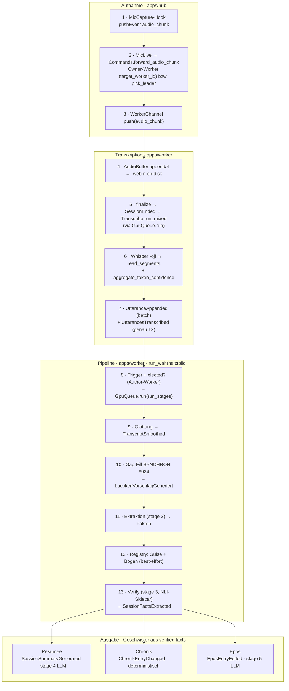

# Pipeline-Flow: Audio → Chronik/Epos/Resümee

Der reale Weg eines Sitzungsmitschnitts durch Hub und Worker — vom Browser-Audio
bis zu den drei abgeleiteten Artefakten. Belegt gegen den Quellcode (`apps/hub`
+ `apps/worker`); Datei/Zeile sind Orientierung, nicht garantiert stabil.

Ergänzt die dichte Referenz-Prosa in `CLAUDE.md` (Abschnitt „Die Pipeline:
Wahrheitsbild") um eine visuelle Flow-Übersicht fürs Onboarding.

> **Interaktive Fassung** (hell/dunkel, farbcodiert): [`docs/pipeline-flow.html`](./pipeline-flow.html)
> — im Browser öffnen (`xdg-open docs/pipeline-flow.html`).

## Überblick

## Schritt für Schritt

| # | Schritt | Datei:Zeile | Event(s) | Settings |
|---|---|---|---|---|
| 1 | Browser-Mikro erfasst Audio (`MicCapture`-Hook, opus/webm 16 kHz) | `apps/hub/assets/js/hooks/record_mic.js` | `audio_chunk` (Channel) | `mic_mode` (per_player/multi) |
| 2 | Hub routet zum Member-Worker | `mic_live.ex:194` → `commands.ex:272`, `pick_leader :286` | — | — |
| 3 | WorkerChannel schiebt den Chunk raus | `worker_channel.ex:249→256` | `push("audio_chunk")` | — |
| 4 | AudioBuffer schreibt on-disk (`IO.binwrite` .webm) | `hub_client/mic.ex:50` → `audio_buffer.ex` | — | `audio_dir` |
| 5 | Stop → `finalize` → Transkription (via `GpuQueue.run`) | `audio_buffer.ex:270`, SessionEnded `:309`, `:625` | `SessionEnded` | — |
| 6 | Whisper `-ojf` → Segmente + Per-Token-Confidence; Raummikro über Diar-Sidecar | `transcribe.ex:747/832`, `transcribe/confidence.ex:145` | — | `whisper_bin`, `whisper_model`, `whisper_lang`, `ffmpeg_bin`, `diarization_sidecar_url` |
| 7 | Utterance-Events (Batch + genau ein Trigger) | `transcribe.ex:508` (batch), `:94` | `UtteranceAppended`, **`UtterancesTranscribed`** | — |
| 8 | Trigger + Author-Worker-Election → `run_stages` | `pipeline.ex:173`, `elected? :225`, `GpuQueue.run :251` | — | — |
| 9 | Glättung (Stage 1.1): Merge/Dedup/Strip, Lücken-Erkennung | `pipeline.ex:335`, `pipeline/smoothing.ex` | `TranscriptSmoothed` | `merge_gap_seconds` (8) |
| 10 | **Gap-Fill synchron** (#924): Vorschlag vor der Extraktion | `pipeline/gap_fill.ex` (`generate_now`) | `LueckenVorschlagGeneriert` | `gapfill_model` (LOCAL) |
| 11 | Extraktion: Blöcke → strukturierte Fakten (der eine Generativschritt) | `pipeline.ex:401` (`Stages.extract_facts`) | — | `backend_stage2`, `model_stage2_*` |
| 12 | Registry: Guise-Merging (#714) + Bogen-Clustering (#832), best-effort | `pipeline.ex:404/410` | `ThreadRegistryComputed` | — |
| 13 | Verify-Gate: Grounding (NLI-Sidecar) + Attribution; Flag statt Drop | `pipeline.ex:417`, `pipeline/verify.ex` | `SessionFactsExtracted` | `backend_stage3`, `faithfulness_sidecar_url` |
| 14a | **Resümee** — Arc-strukturierter Prosa-Recap mit Render-Gate | `pipeline.ex:439` (`Render.render_summary`) | `SessionSummaryGenerated` | `backend_stage4` |
| 14b | **Chronik** — deterministische Datierung (kein LLM) | `pipeline.ex:447` (`Timeline.Graph.resolve` → `Render.timeline`) | `ChronikEntryChanged` | — |
| 14c | **Epos** — Erzähl-Kapitel pro Session | `pipeline.ex:450` (`Render.render_epos`) | `EposEntryEdited` | `backend_stage5` |

## Was man wissen muss

- **Ein GPU-Slot pro Lauf.** Der ganze `run_stages`-Lauf ist **ein** `GpuQueue.run`-Job
  (`pipeline.ex:252`) — deshalb läuft der Gap-Fill (#924) **inline**, nicht als
  geschachteltes `GpuQueue.run` (das wäre ein Deadlock). Die GPU-Serialisierung
  gegen Probelauf/andere Läufe erbt der ganze Lauf.
- **Author-Worker-Election** (`elected?/2`, #365): nur der Worker, der
  `UtterancesTranscribed` selbst produziert hat, fährt die Pipeline — keine
  Doppel-LLM-Calls bei mehreren Member-Workern. Catch-up/Pull-Events tragen
  `author_worker_id == nil` und werden übersprungen.
- **Pro Stufe ein eigenes Backend + Modell** (`backend_stage2..5`), damit z. B. der
  Verify-Judge stärker sein kann als der Extraktor (#783).
- **Drei fehler-entkoppelte Geschwister** aus denselben verifizierten Fakten
  (`run_wahrheitsbild`, `pipeline.ex:427–458`): ein Fehlschlag eines Renders reißt
  die anderen nicht mit; jeder Schritt läuft in `with_status` → eigene Fehlerklasse
  in `/admin/errors`.
- **Chronik ist deterministisch** (kein LLM) — sie datiert die Fakten über
  Anker + Offset (`Timeline.Graph.resolve`), Resümee und Epos sind die
  LLM-Renders.
