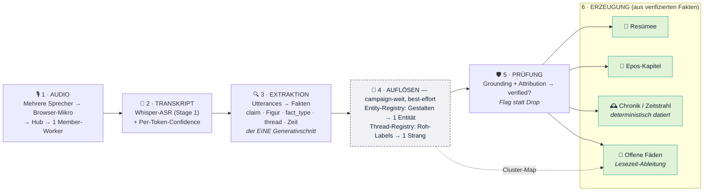

# Die Wahrheitsbild-Pipeline

Der Weg von der Tisch-Aufnahme zum durchsuchbaren Kampagnen-Gedächtnis. Seit
Issue #786 ist das der **einzige** Pfad (die frühere Prosa-Chain Stage 2→3→4 ist
entfernt). Details zu den einzelnen Bausteinen: `CLAUDE.md` → „Die Pipeline:
Wahrheitsbild".

## Die Stufen

**1 · AUDIO** — Mehrere Spieler sprechen; das Browser-Mikro schickt die
Audio-Chunks an den Hub, der sie an genau einen Member-Worker routet
(`Hub.Commands.pick_leader/2`).

**2 · TRANSKRIPT** (Stage 1, ASR) — Whisper transkribiert pro Sprecher, mit
Per-Token-Confidence als Routing-Signal (Issues #376/#381). Ergebnis:
`UtterancesTranscribed` — kurze, sprecher-getaggte Häppchen.

**3 · EXTRAKTION** (`extract_facts`) — Der **eine** Generativschritt: aus den
Utterances werden strukturierte, im Text belegte **Fakten** (`claim` + Figur +
`fact_type` + `thread` + Zeitfelder). Map-Reduce für lange Sitzungen (#683).
Keine Prosa, keine Ausschmückung.

**4 · AUFLÖSEN** (best-effort, campaign-weit) — Zwei Clustering-Schritte über
*alle* Fakten der Kampagne: die **Entity-Registry** (#714) führt Gestalten
zusammen („König" / „Graf von Kramm" / „Wilhelm" → eine Entität), die
**Thread-Registry** (#832) clustert die rohen Strang-Labels zu kanonischen
Handlungssträngen. Fehler hier degradieren nur (kein Merge ist besser als ein
falscher) und landen als eigene Klasse in `/admin/errors`.

**5 · PRÜFUNG** (Verify-Gate) — Jeder Fakt wird gegen den Quelltext geerdet und
der Figur zugeordnet: `verified? = grounded? AND attributed?`. **Flag statt
Drop** — ungeprüfte Fakten bleiben sichtbar-markiert, statt zu verschwinden.

**6 · ERZEUGUNG** — Aus den **verifizierten** Fakten entstehen vier
fehler-entkoppelte Geschwister:

| Artefakt | Was |
|---|---|
| **Resümee** | sachliche Zusammenfassung pro Sitzung |
| **Epos-Kapitel** | literarisches Kapitel pro Sitzung (#752) |
| **Chronik / Zeitstrahl** | deterministisch datiert — Elixir rechnet, das LLM liefert nur Anker+Offset (#724) |
| **Offene Fäden** | Handlungsstränge mit Status (offen/ruhend), abgeleitet zur *Lesezeit* aus verifizierten Fakten + Thread-Map (#833/#839) — kein Render-Schritt |

Die ersten drei sind gerenderte Artefakte (LLM hinter dem Verify-Gate, Stil-Flavors
wirken hier). Die **Offenen Fäden** sind anders in der Art: eine deterministische
Lesezeit-Gruppierung (`Worker.Repo.campaign_threads/1`), kein Generativschritt.
