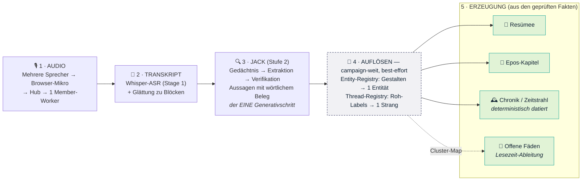

# Die Wahrheitsbild-Pipeline

Der Weg von der Tisch-Aufnahme zum durchsuchbaren Kampagnen-Gedächtnis. Seit
Issue #786 ist das der **einzige** Pfad (die frühere Prosa-Chain Stage 2→3→4 ist
entfernt); seit J4 (#1207) extrahiert **Jack**, und die separate Prüfung durch
ein zweites Modell (Verify-Gate) entfällt. Details zu den einzelnen Bausteinen:
`CLAUDE.md` → „Die Pipeline: Wahrheitsbild“ und „Stufe 2 ist Jack“.

```mermaid
flowchart LR
    A["🎙️ 1 · AUDIO<br/>Mehrere Sprecher → Browser-Mikro<br/>→ Hub → 1 Member-Worker"]
    T["📝 2 · TRANSKRIPT<br/>Whisper-ASR (Stage 1)<br/>+ Glättung zu Blöcken"]
    E["🔍 3 · JACK (Stufe 2)<br/>Gedächtnis → Extraktion → Verifikation<br/>Aussagen mit wörtlichem Beleg<br/><i>der EINE Generativschritt</i>"]
    R["🧩 4 · AUFLÖSEN — campaign-weit, best-effort<br/>Entity-Registry: Gestalten → 1 Entität<br/>Thread-Registry: Roh-Labels → 1 Strang"]

    subgraph G["5 · ERZEUGUNG (aus den geprüften Fakten)"]
        direction TB
        S["📖 Resümee"]
        Ep["📜 Epos-Kapitel"]
        C["🕰️ Chronik / Zeitstrahl<br/><i>deterministisch datiert</i>"]
        Th["🧵 Offene Fäden<br/><i>Lesezeit-Ableitung</i>"]
    end

    A --> T --> E --> R
    R --> S
    R --> Ep
    R --> C
    R -. Cluster-Map .-> Th

    classDef gen fill:#1FA89A22,stroke:#1FA89A,color:#123;
    classDef best fill:#2B2E5A11,stroke:#2B2E5A,stroke-dasharray:4 3,color:#123;
    class S,Ep,C,Th gen;
    class R best;
```

## Die Stufen

**1 · AUDIO** — Mehrere Spieler sprechen; das Browser-Mikro schickt die
Audio-Chunks an den Hub, der sie an genau einen Member-Worker routet
(`Hub.Commands.pick_leader/2`).

**2 · TRANSKRIPT** (Stage 1, ASR) — Whisper transkribiert pro Sprecher, mit
Per-Token-Confidence als Routing-Signal (Issues #376/#381). Ergebnis:
`UtterancesTranscribed` — kurze, sprecher-getaggte Häppchen. Danach glättet die
Pipeline deterministisch zu **Blöcken** (Sprecher-Merge, Stotter-Dedup,
Füllwort-Strip; Blöcke mit ASR-Lücke bekommen einen Gap-Fill-Vorschlag) — die
Einheit, auf der alles Weitere rechnet.

**3 · JACK** (Stufe 2, seit J4 #1207) — Der **eine** Generativschritt: ein
lokales Modell mit Werkzeugen liest die Blöcke einer Sitzung mehrmals —
**Gedächtnis** (Überblick), **Extraktion** (Aussagen eintragen),
**Verifikationen** (Übersehenes suchen), bis zwei in Folge nichts Neues bringen
(höchstens 8). Jede Aussage braucht ein wörtliches Zitat aus den genannten
Blöcken, sonst lehnt das Werkzeug sie ab. Daraus werden die **Fakten**
(`claim` + Figur + `fact_type` + `threads` + Zeitfelder). Keine Prosa, keine
Ausschmückung. Die frühere Extraktion (ein Prompt, Map-Reduce für lange
Sitzungen #683) und die Prüfung durch ein zweites Modell (Verify-Gate) sind mit
J4 entfernt. Ein Regellauf gehört zum Durchgang, ist aber noch nicht gebaut.

**4 · AUFLÖSEN** (best-effort, campaign-weit) — Zwei Clustering-Schritte über
*alle* Fakten der Kampagne, beide auf Jacks Modell: die **Entity-Registry**
(#714) führt Gestalten zusammen („König" / „Graf von Kramm" / „Wilhelm" → eine
Entität), die **Thread-Registry** (#832) clustert die rohen Strang-Labels zu
kanonischen Handlungssträngen. Fehler hier degradieren nur (kein Merge ist
besser als ein falscher) und landen als eigene Klasse in `/admin/errors`.

**5 · ERZEUGUNG** — Aus den Fakten entstehen vier fehler-entkoppelte
Geschwister:

| Artefakt | Was |
|---|---|
| **Resümee** | sachliche Zusammenfassung pro Sitzung |
| **Epos-Kapitel** | literarisches Kapitel pro Sitzung (#752) |
| **Chronik / Zeitstrahl** | deterministisch datiert — Elixir rechnet, das LLM liefert nur Anker+Offset (#724) |
| **Offene Fäden** | Handlungsstränge mit Status (offen/ruhend), abgeleitet zur *Lesezeit* aus den Fakten + Thread-Map (#833/#839) — kein Render-Schritt |

Die ersten drei sind gerenderte Artefakte (LLM, Stil-Flavors wirken hier; die
Prosa darf ausschmücken, geprüft werden die Fakten, #1124). Die **Offenen
Fäden** sind anders in der Art: eine deterministische Lesezeit-Gruppierung
(`Worker.Repo.campaign_threads/1`), kein Generativschritt.
